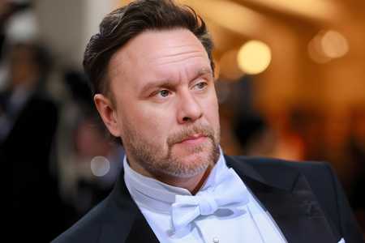

# Faceoff 

**Img2Image - Img2GIF - Img2MP4**

Swap faces from a source image to a destination medium. Each app runs independelty in it's own Gradio instance for ease of use.

Read more at [https://thebiglaskowski.com/posts/face-swapping-with-ai](https://thebiglaskowski.com/posts/face-swapping-with-ai/)

## Demo: Faceoff Img2MP4 vs DeepFaceLab Deepfake

Faceoff on the left, DeepFaceLab on the right

https://github.com/thebiglaskowski/faceoff/assets/5170343/9f30932c-bfed-4dbe-9131-eaee92a854de

## Installation

### Dependencies

1. FFmpeg

[Download and install FFmpeg](https://ffmpeg.org/download.html)

2. [CUDA >= 10.1](https://developer.nvidia.com/cuda-10.1-download-archive-base)

3. Requirements

```powershell
git clone https://github.com/thebiglaskowski/faceoff.git
cd faceoff
conda create -n faceoff python=3.8 -y
conda activate faceoff
pip install torch==1.11.0+cu115 torchvision==0.12.0+cu115 -f https://download.pytorch.org/whl/torch_stable.html

# If not using CodeFormer enhancement use this torch & torchvision version instead

pip install torch==2.0.0+cu118 -f https://download.pytorch.org/whl/torch_stable.html torchvision==0.15.1+cu118 -f https://download.pytorch.org/whl/torch_stable.html

pip install -r requirements.txt
```

4. Download the [inswapper_128.onnx model](https://huggingface.co/thebiglaskowski/inswapper_128.onnx/tree/main) from Hugging Face and place it in the root directory of this project.

## Usage

### Faceoff Img2Img

```powershell
python faceoff.py
```

<http://127.0.0.1:5000/>




### Faceoff Img2GIF

```powershell
python faceoff_gif.py 
```

<http://127.0.0.1:5001/>


### Faceoff Img2MP4

```powershell
python faceoff_video.py
```

<http://127.0.0.1:5002/>

## Demo: Faceoff Img2MP4 - Basic vs Enhanced (w/CodeFormer)

Basic on the left, Enhanced on the right

https://github.com/thebiglaskowski/faceoff/assets/5170343/cd2eec67-2233-4813-ae16-5d3554c61884

Sarah Connor?

[](https://www.youtube.com/embed/H7KS8ZoulGw)

## To Do

- [ ] Add Enhanced version of Img2GIF
- [ ] Add Enhanced version of Img2MP4

## Special Thanks To

- [FFMpeg](https://github.com/FFmpeg/FFmpeg)
- [InsightFace](https://github.com/deepinsight/insightface)
- [Real-ESRGAN](https://github.com/xinntao/Real-ESRGAN)
- [CodeFormer](https://github.com/sczhou/CodeFormer)
- [Open-AI GPT](https://github.com/openai)
- [PyTorch](https://github.com/pytorch/pytorch)
- [Torchvision](https://github.com/pytorch/pytorch)
